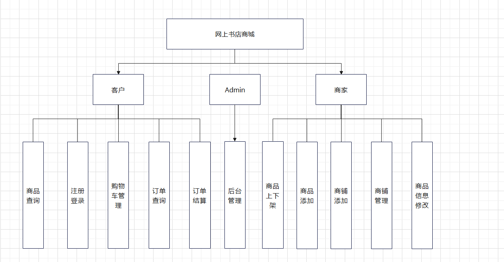
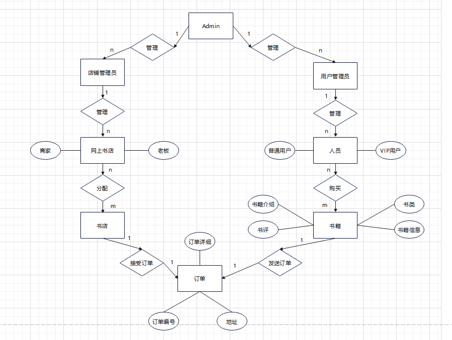
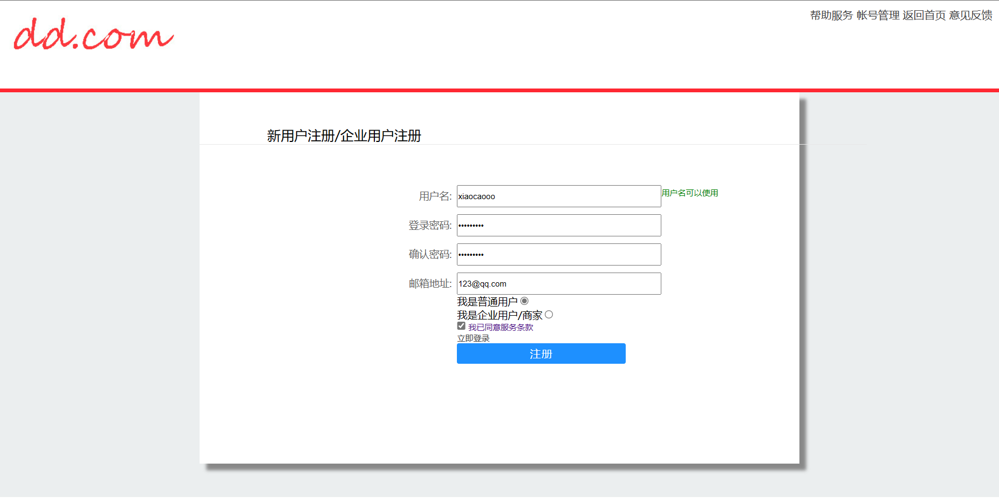
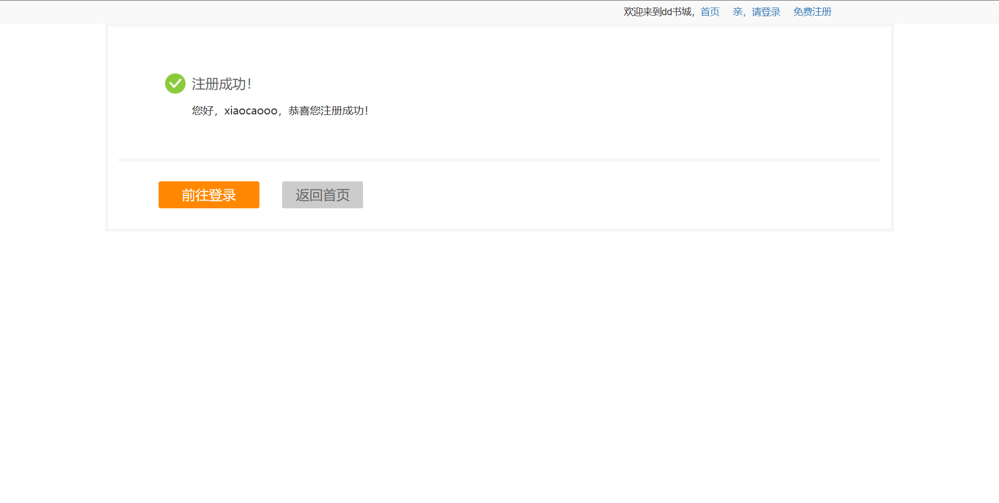
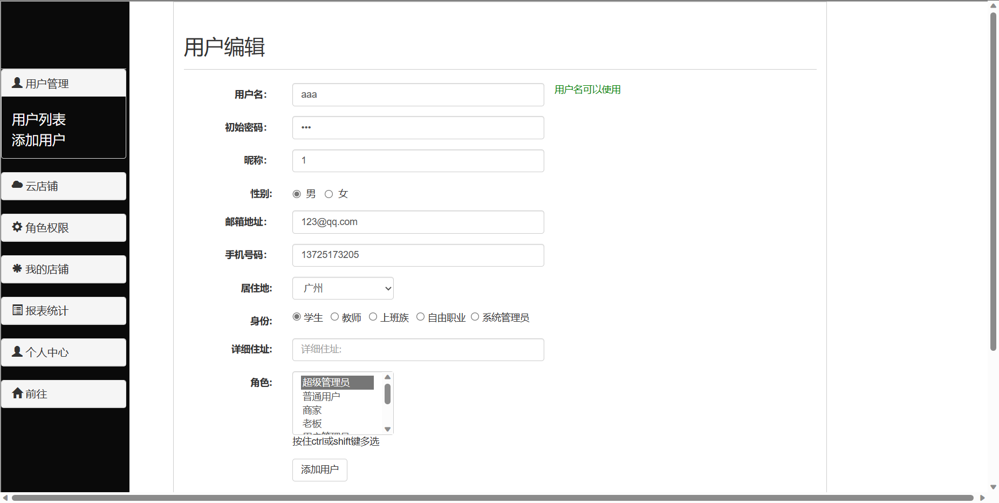
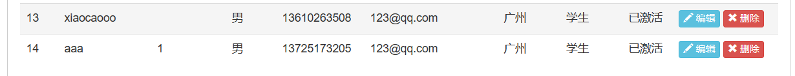
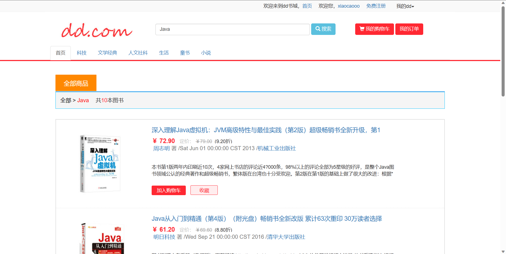
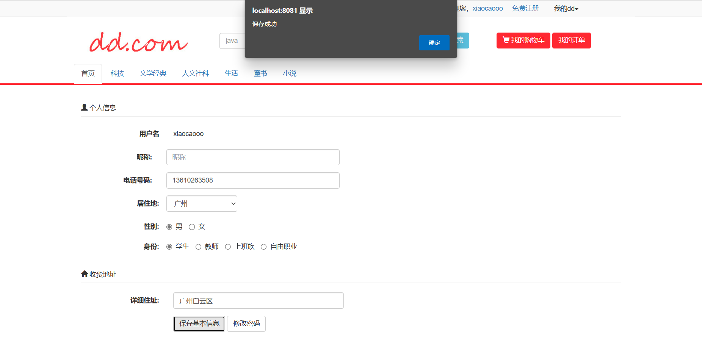
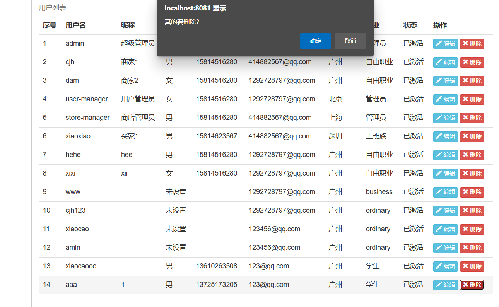

# SpringCloud期末大作业

#### 介绍
该项目的主要目标是使用Springboot开发技术开发一个“书店网上商城系统”，
该系统不仅需要满足顾客注册、登录、在web端浏览商品、加入购物车、提交支付订单、查询已支付、未支付订单等的需求，
还需要满足网上书店的经营管理者管理商城商品以及管理线下分店的需求。
同时，系统也需要具备安全控制、权限控制等功能，商家或客户在进行相关操作时必须登录才有权限进行操作等。系统应该尽可能做到功能丰富、界面美观。
#### 软件架构
软件架构说明

#### 安装说明

1.  连接数据库，导入系统表。
2.  等待系统自动导包。
3.  运行主文件注意端口不要被占用。

#### 数据库E-R图

#### 运行效果说明

1.登录注册页面

2.添加功能

3.查询功能

4.修改功能

5.删除功能

